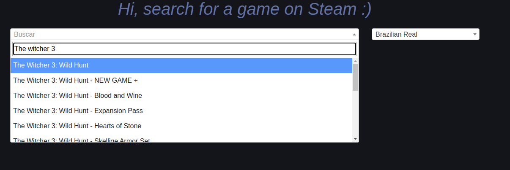

# Games info

### Search a game or dlc and receive some nerd informations about it.

---

## Usage

#### Do your search



#### The result will brings something like:


## How it works

The project consume a big json from steam, that data gives all "apps" with their respective names and ids.\
With a django command, this json data is inserted in the database to be used in the api.

With the app id, the crawler initially go in the steam api and get informations about this game.\
And then, on this moment, the crawler get the returned name from steam and search in [How Long To Beat](https://howlongtobeat.com/) and get the first result.


## Build

Create a .env file in the project root, you can use the example.env to see what variables is used.\
Is recomended use DB_USER=root to run tests without problems.\
If you want another user name, change the user in sql script games-info/sql/grant_privileges.sql


Build the docker
```
docker-compose up
```
Go in the web container and run:
```
python manage.py makemigrations
python manage.py migrate
python manage.py crawler_setup
```
_crawler_setup_ To insert gris and outer wilds in the database, so you can use to develop.

If you want the full database with more than 146000 items.\
Go in the web container and run:
```
python manage.py crawler_steam_appids
```
This will take some minutes.


## Running tests

Just call in the web container:
```
python manage.py test
```

---

I'm building this project for fun on my free time :)